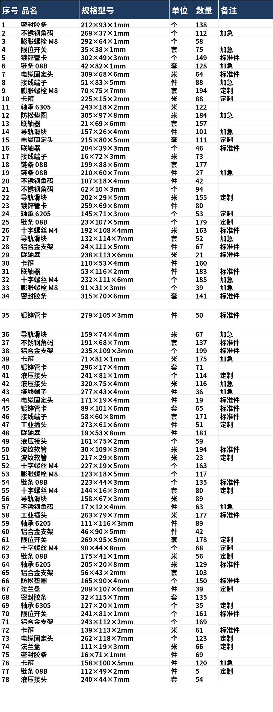

# table-slice-parse

<p align="center">
  
  
  
  
</p>

长表格截图切片解析为结构化表格的开源技能/管线：检测表格结构 → 横线切割 →
MinerU 强制表格识别 → 智能拼接校验 → 输出 CSV / Markdown。

适用于超长清单表、多行单元格表格（如明细表、目录表），解决 OCR 识别不全、
列错位、空行、被识别为纯文本等问题。

## 为什么用它

超长表格长图/PDF 是 OCR 的重灾区：整图一次识别会丢行、错列、甚至被当成
普通文本段落。本管线把问题拆成四段（结构检测 → 横线切割 → MinerU 强制表格
识别 → 智能拼接校验），让多行单元格、跨页长表都能收敛成干净、可用的 CSV。

## 演示



一张 78 行的合成长表格（纯随机数据，无任何真实业务内容），可以当作测试样例：
`cut_only.py` 切出多片 → `mineru_direct.py --force-table` 逐片识别 →
`smart_merge.py` 拼接校验 → `merged/table/merged.csv`。

## 组件

- `SKILL.md` — 技能入口（frontmatter + 使用流程）
- `scripts/cut_only.py` — 横线切割（自动检测结构）
- `scripts/mineru_direct.py` — MinerU 管线直连解析，`--force-table` 强制表格识别
  （monkey-patch 布局阶段 text→table）
- `scripts/smart_merge.py` — 切片智能拼接 + 偏差校验
- `scripts/detect_structure.py` — 表格结构检测（列基准确认等）
- `setup.ps1` — Windows 一键建 MinerU 环境
- `setup_server.sh` — Linux 服务器部署（torch-CPU，无需独显）

## 用法

```bash
# 1. 横线切割
python scripts/cut_only.py --images table.png longsheet.png --out slices/

# 2. MinerU 解析（强制表格识别）
<mineru-venv>/bin/python scripts/mineru_direct.py \
    --input slices/table/slices --output mineru_out/table --force-table

# 3. 智能拼接校验 → merged/table/{merged.md, merged.csv, structure.json}
python scripts/smart_merge.py --image table.png --slices mineru_out/table --output merged/table
```

## 说明

- MinerU 模型（PDF-Extract-Kit，约 2.6GB）首次运行自动从 ModelScope 下载。
- 示例图片未随仓库提供（多为业务数据），请使用自己的表格截图测试。
- Linux 服务器部署走 CPU（无需显存，可与其它 GPU 服务共存），实测约 8 秒/片，
  速度视表格复杂度而定；有 NVIDIA GPU 时可自行开启 CUDA 加速。
- License: MIT（详见 `SKILL.md` 头部）。

## 相关项目

- [ragkg](https://github.com/pjc2005/ragkg) — 自托管 RAG + 知识图谱问答系统（本地 LLM）
- [Yanaa](https://github.com/pjc2005/Yanaa) — Android 本地 LLM 自动记账
- [Kinon](https://github.com/pjc2005/Kinon) — Windows 快捷键查看工具